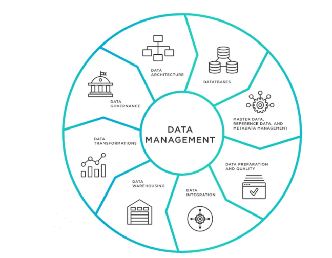

# Data Governance 101

# Table of Contents

1. [Data Governance](#dg)
2. [Data Governance Program](#dgp)
3. [Data Governance Skills](#dgs)
4. [Data Governance Tools](#dgt)
5. [Data Governance Challanges](#dgc)
6. [Data Governance Best Practices](#dgbp)
7. [General Data Protection Regulation](#gdpr)
8. [Sumitomo Mitsui Banking Coporation](#smbc)
9. [Data Management](#dm)

## 1. Data Governance 
DG is a practice that connects different components together such as roles, processes, communincations, metrics and tools to increase datas value.  
By harmonising these fundementals, governance ensures that the right data flows effeciently to the right resources at the right time.  
While DG forms an essential part of Data Management, it does not encompass all aspects of data management. Instead, governance focuses specifically on structuring ploicies and procedures around the data. 
Organisations prioritise DG to get better data quality and BI as well as to protect their information and comply with international regulatory bodies GDPR.

## 2. Data Governance Program 

A DG program aims to coordinate people, technology and activiteis throughout the enterprise. It represents a complete journey starting with a shared desire toward imporve data creation, transformation and usage to meet data goals and KPIs (Key Performance Indicators).  
### Initiation
A DG program needs the right people to fund and create the program, including a DG lead. Typically this person comes from a senior management and initiates the DG program.
### Developing
DG leadership starts by developing and implementing a Data Governance Framework, collection of processes, rules and resposibilites to formally structre a governance program.
### Establishing roles and responsibilities
Next the DG lead will look to establish DG roles and responsibilities. These include:
### - Data Governance Committee (Usually DM and Stakeholders)
A core group of representatives across an organisation that interprets and decides how to execute the DG framework. They may also suggest updates to exsisting frameworks.
### - Data Sterwards (Department Representatives)
Data stewards work with the data daily on the ground. They ensure their divisions implemenent governance decision and bring any questions or problems back to the governance program. They may also train co-workers on governance program protocols and communicate helpful solutions.
### - Everyone
Everyone in the organisation is still responsible for how the firm organises it data and stays compliant with regulations. Employyes need to participate in governance training to understand the guidlines.
### - Summary
Throughout its lifespan, a DG program primarily focuses on changing the work place culture and how employees handle and think about data.
## 3. Data Governance Skills 
For DG to work, everyone needs to aquire some basic skills and understanding. These capabilities include:
- Data literacy
- Communication
- Understand data
- Interpreting data
### Data Governance Owner
A responsible executive owns the purse strings and has accountability for the DG program. This person must have:
- Clear data strategy
- Passion for data
- Good sense of what data investments pay off
- Outstanding social skills
- Handle politics around people and data
### Data Governance Lead
A DG lead deals with communiting the program through the development lifespan so they require to have skills such as:
- Great communication
- Empahise with members
- Market DG initiatives
- Train others on DG regulations
- Decision making for issues
- Function in an adaptive enviroment
### Data Steward
Data stewards will be working with the data daily and understand its pipeline process. These means stewards need to have skill such as:
- Communication
- Giving feedback
- Sense of humour
- Listening
- Strong ego as decisions can get heated
## 4. Data Governance Tool 
DG tools enable alignment with a governance program and supports its management and foundational activities through automation. Automated DG tools support the following:
### Data Security and Privacy
These tools monitor legal validation and enforce regulatory compliance. Such software can set information security controls, run helpful audits and reports on potential security risks.
### Data Architecture
Data Arch tools server address operational effciencies and smiplify data intergration with other systems
### Data Modelling
Data modelling tools ensure that the data is structures, well organsised and is standardised througout the ensure fluidity and interpretation of the data.
### Data Design (Centralised inventory of data assets by colleting metadata)
Data Catologs make up an essential automated data design tool. Data Catalogs describe the avaliable data assets in the company and where to find them.
### Data Quality
These tools ensure the data is clean and does no contain errors which can lead to huge consequences down the line such as false represntation, distrupting processes and not ensuring data integrity.
### Metadata Management (Data about data) (Table: Customers, Metadata: CusomterID, CustomerAge etc)
Metadata management tools automate data classification tasks so that people and systems can find and access what they need for work activities.
## 5. Data Governance Challanges 
The biggest challanges for DG is around allignment and culture. 
### Integration
Organisations tend to grow their data organically with 'more departments'. 
 This growth is great for organisations but it comes with extra work to ensure governance protocls allign and there are no cross-overs.  
Ensuring the DG program can be integrated across all departments can be very tricky as some people want to do data the way they always have and changing can results in complications.
### Liasing
Verbally agreeing in meetings to implement newer data processes while continuing to do the same activites.
### Facts
DG starts strong with enthusiasm and commitment but lack clear communication to implement policies. 
Capital One survey says, 82% of participants reported confusing governance policies as top difficulty.  
## 6. Data Governance Best Practices 
### Establishing a single executive owner
This is the most important and best DG practice as this person is reposible for accountability, budget authority, make big decisions, strategic move of data movements. Having a single person at the lead set authority and allows other to understand the chain of command.
### Other good practices
#### - Identify a DG lead
#### - Objective for the DG program
#### - Structure for the DG program
#### - Roadmap for the DG program
#### - Communicate the success of a DG program
#### - Establish tools and resources
## 7. General Data Protection Regulation 
GDPR ensures data privacy policies across europe are adhered to and set the guidlines for how personal data of indivduals is process and transferred. Other key princples include:
### Lawfulness, fairness and transparency
Data should be used in a lawful manner and not used to target, harass or distrupt people
### Purpose
Data should only be collected for specified, explicit and legitimate purposes
### Data minimisation
Collect only the data that is required
### Accuracy
Ensure the data is accruate and up to date
### Storage limitation
Store data only for as long as necessary
### Integrity and Confidentiallity
Ensure data is process securely using appropriate technical and oragnsational measures
### Accountabilty
The organisation is held accountable for handling and security of the data
---
### Individual Rights
- The right to ask how your data is being used
- The right to access your data
- The right to have incorrect data updated
- The right to have data erased
- The right to object to how your data is processed in circumstances
## 8. Sumitomo Mitsui Banking Corporation 
SMBC is a japanese multinational banking and financial services company. Services include individual and coporate loans, credit cards, investment banking and securities.
### Parent Company (SMFinancial Group)
## 9. Data Management 

Data management is the practice of organising and colleting organisations data so it can be analysed for business decisions.  
Data is processed at large voumes in todays organisation and its important that the whole processed is managed
### Type of Data Management
- Data Modelling
- Data Governance
- Data Pipelines
- Data Warehouse
- Data Lakes
- Data Security