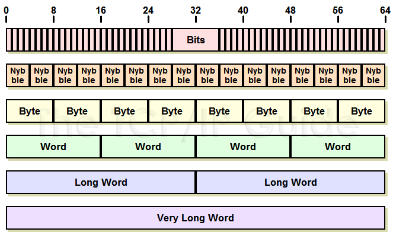
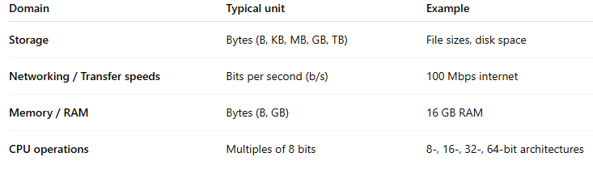
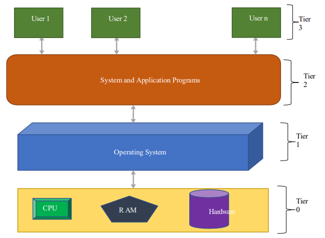
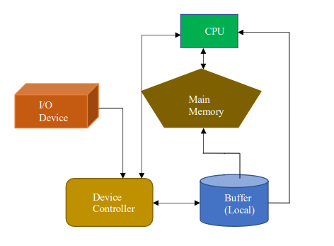
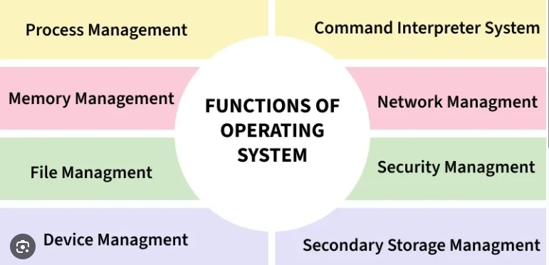
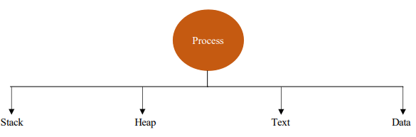
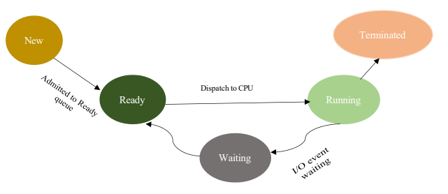
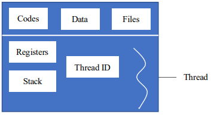
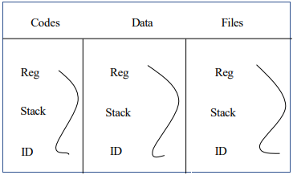

Operating Systems

# Table of Contents
1. [Software Types](#software_types)
2. [Bits, Bytes and Binary](#bbb)
3. [Computer Systems](#cs)
4. [Operating Systems](#os)
5. [Processes](#processes)
6. [Threads](#threads)
7. 
8. 
9. 

## Software Types 
### Software
The piece of code/ program or set of instructions to execute a specific task is called software. The software can be two types, system software and application software
### System Software
SS are designed to manage the systems and their activites e.g. operating systems and utility programs etc.
### Application Software
AS allows the users to interact with the computational systems or system software e.g. Microsoft office suite, adobe, video platers etc.
## Bits, Bytes and Binary 
### Binary
Binary is the base-2 numeral system that computers use to process and store data.
### Bit
A bit is the smallest unit of data, representing a single binary value 0 or 1.
  Smallest unit of data a computer can process. (Logic gates, AND, OR, ELSE)
  A nibble is 4 bits (1/2 byte)
  A word is 16 bits (2 bytes)
### Byte
A byte is 8 bits and is used to represent more complex information such as a single character.
  A byte is the smallest addressable unit of memory in most computer architectures
  A byte can represnt 256 possible values 2^8.

### Usage types
Storage in bytes (B) MBs 
Netowkring in bits (b) Mbps 
Memory/ RAM in bytes (B) MB 
CPU in multiple of bytes (B) 8, 16, 32 

## Computer Systems 
The Computer Systen is mainly organised into four tiers:
- Tier 0: Lowevel level, Computer hardware RAM, CPU, ROM, HardDrive
- Tier 1: Operating System, Handles the computer hardware
- Tier 2: System and Application Programs, Compilers, Assemblers, Drivers, Antiviruses etc.
- Tier 3: Users, users have to access the hardware through the OS

### Computer System Operation
A modern computer consists of the following components:
- Central Processing Unit CPU
- Device Controller DC
- Memory

A CPU has two internal parts:
- Control Unit CU
- Arithmetic Logic ALU

The CU fetches the instructions from the RAM and ALU firstly, executes it and then forwards the output to Main Memmory MM or I/O Device.  
The CPU and the DC are connected through common bus which provides the access to shared memory. Each DC is in charge of a specific type of device e.g. divers, audio, I/O devices. The CPU and the DC both can execute in parallel therefore there could be clash of memory access which can be resolved by memory management controllers. Since the CPU is much faster than I/O devices therefore to avoid the CPU idel state, the DC uses a local buffer which manages the operations.
1. The DC takes the data/ process from the I/O Devices and then stores it in the local buffer
2. When the process gets completed then the DC sends an interrupt to CPU so the CPU can disengage itself with the on-going tasks
3. CPU then moves the process from the local buffer to the MM and executes it.
- 
## Operating System 
OS is a system software which:
- Acts as an intermediatary beytween hardware and the user
- Manages the system resources between the hardware and software
- Provides a platform on which other applicationprograms are installed
OS essentaily bypassing having to interact directly with the hardware which would be hard in manchine code
### OS Functions
The primary goal of a OS is UI while efficency is considered a secondary goal. For network OS or and other server based computing enviroments this is vise-versa. Main functions of an OS:
- Process Management
- Memory Management (RAM)
- Storage Management
- - File System Management
- - Mass Storage Management
- - Chaching
- I/O Device Management
- Network Management
- Security and Protection

## Processes 
When we run a program, its instructions get loaded onto the RAM and that instance of the program is called a process. A process is a program in execution. A process is divided into four components:
- Stack: Holds the temporary data e.g. functions, parameters, local variables
- Heap: Dynamically allocates the memory during run time
- Data: Contains global variables and static variables
- Text: Includes program counter and contents of the process registers

### Process States
When a process is being executed, it changes through various states, these include:
- New: Creation
- Ready: Process is waiting in ready queue to be assigned
- Running: Instructions are being executed
- Waiting: Waiting for some event to occur, I/O or response from hardware
- Terminated: Process execution complete

### Process Control Block PCB
It holds the detailed information about the process. Every process has a PCB. The PCB is the data structure maintained by the OS for every process. It consists of:
- Process ID
- State
- Pointer: The connections of the process e.g. child, parent
- Priority: Priority of the process
- Program Counter: Points to the next instruction
- CPU Register: Holds the information about the registers which will be used by the process
- I/O Information: Devices required by the process
### Process Scheduling
CPU executes one process at a time and it allocates same time slice to each process (Round Robin). If any process did not complete in that slice of time then it moves to the waiting state. However that is a specific algortihims which determine the execution process such as FCFS, SJF, Round Robin etc.
## Threads 
A process is an instance of a running program with its own dedicated memory space, making it independent but slower to create and switch between.  
A thread is a unit of execution within a process that shares the process memory making it faster to create and switch between but less fault taulerant. One process can have many threads (Multithreaded processes) where each thread comprises of:
- Program Counter
- Program ID
- Set of Registers
- Stack
Some threads (Kernel Level Thread) also require TCB (Thread Control Block) which resides in the Kernel. The CPU executes only one thread at a time. As context switching which is the switching of threads happens so fast, it almost seems instant.  
Benefits of threads are:
- Responsiveness: Since the context switching is fast, due to the threads sharing memory, this makes process run seeminglessly.
- Resource sharing: Threads share resources of a process.
- Economy: No seperate memory allocation for threads and no system call designs.
- Scalability: Multi-core processors can be easily intergrated in threading enviroment.
### My Take on a Thread
A thread is a unit of execution of a process so if a process is a single-threaded process then that thread is resposible for handling the whole execution. However if a system is mult-threaded, the threads are resposbile for handling a sequence of instructions within the larger context of the process. Threads can have multiple instructions to execute and are assigned a specific time dependednt on the scheduling algorithm which determines which thread should be given CPU time. Context switching is the switch of a thread and this happens seeminglessly.
### Multicore Programming
Typically has two components, a CU (Control Unit) and a ALU (Algorithmic Logic Unit). The CU fetches the instructions and decodes while the ALU executes the instructions and forwards the results to I/O devices or RAM. A single core CPU contains one CU and ALU while multicore CPUs execute mutliple CU and ALU tasks.
### Types of Threaded Processes
#### Single Threaded Processes
Single threded processes are processes which only include one thread which performs on specific task.

#### Multi-threaded Processes
Multithreaded process are processes which contain multiple threads which each perform specific tasks by context switching between. Even though threads contain their own variables, the overall variables of the processes such as Codes, Data and Files are shared between all threads which means they are always cooperating. Each thread has its own:
- Registers
- ID
- Stack

